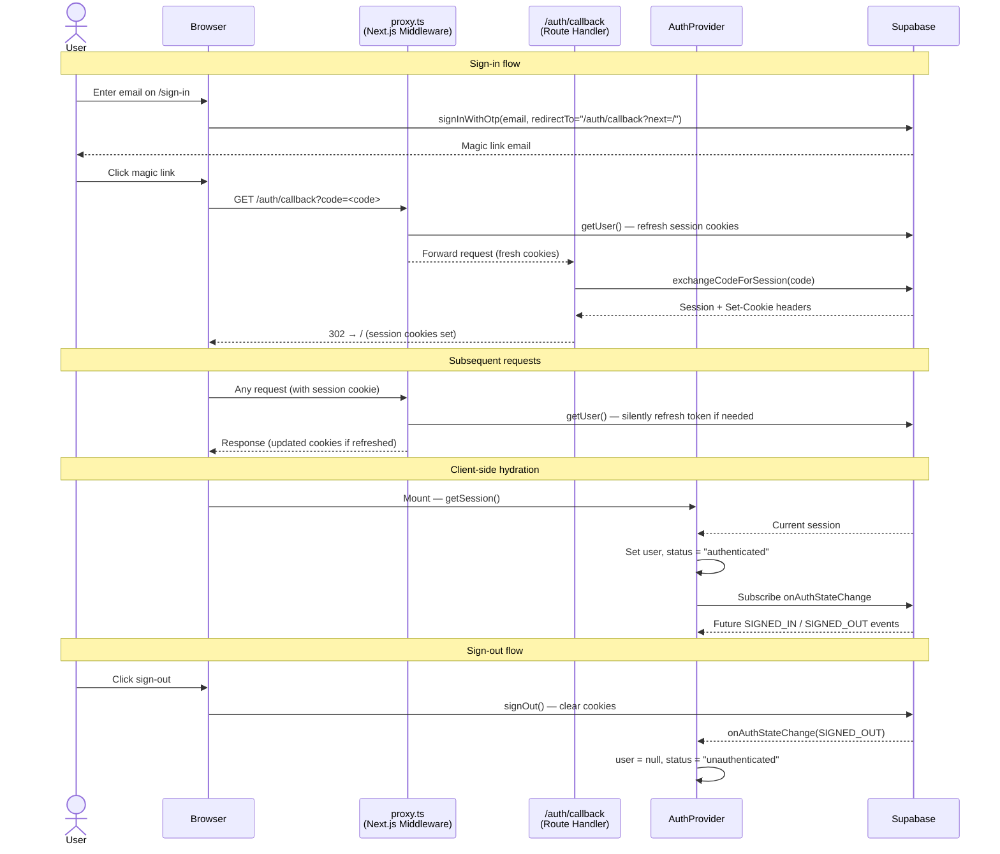

# Authentication System

dranki uses **Supabase Auth** with the **magic link (OTP) flow** — no passwords. The implementation is split across `src/features/auth/` and `src/proxy.ts`.

---

## Overview

| Layer | File(s) | Runtime |
|---|---|---|
| Middleware (session refresh) | `src/proxy.ts` | Edge / Next.js Middleware |
| Supabase browser client | `supabase/client.ts` | Browser |
| Supabase server client | `supabase/server.next.ts` / `server.tns.ts` | Server |
| Server client adapter | `supabase/server.adapter.ts` | Server (build-time swap) |
| Auth actions | `actions/` | Browser + Server |
| Callback handler | `app/auth/callback/route.ts` | Server |
| React provider & hook | `provider/auth-provider.tsx` | Browser |

---

## Authentication Flow

### 1. Sign-in (magic link)

1. User enters their email on `/sign-in`.
2. The UI calls `signInWithMagicLink(email)` (`actions/sign-in-with-magic-link.ts`).
3. Under the hood: `supabase.auth.signInWithOtp({ email, options: { emailRedirectTo: "<origin>/auth/callback?next=/" } })`.
4. Supabase sends a magic link to the user's email.

### 2. Callback — code exchange

1. User clicks the magic link → browser navigates to `/auth/callback?code=<code>&next=/`.
2. The Next.js route handler (`app/auth/callback/route.ts`) reads `code` from the URL.
3. Calls `exchangeCodeForSession(code)` (`callback/exchange-code.next.ts`).
4. Supabase exchanges the one-time code for a session and writes session cookies via the server client.
5. Handler redirects to `next` (defaults to `/`). On error, redirects to `/sign-in?error=<message>`.

### 3. Session refresh (every request)

`src/proxy.ts` is the Next.js Middleware. It matches every request except static assets and:

1. Creates a lightweight Supabase server client wired to the request cookies.
2. Calls `supabase.auth.getUser()` — this silently refreshes the access token when it is about to expire and writes the updated cookies to the response.
3. The response (with fresh cookies) is forwarded to the actual handler.

### 4. Client-side sync

`AuthProvider` (`provider/auth-provider.tsx`) is a React context provider that:

1. Initialises from `initialUser` (passed from a server component via `getUser()`) so the UI is correct on first render without a flash.
2. Calls `supabase.auth.getSession()` on mount to hydrate `session`, `user`, and `status`.
3. Subscribes to `onAuthStateChange` so any session event (sign-in, sign-out, token refresh) is reflected immediately.
4. Exposes `{ session, status, user, signInWithMagicLink, signOut }` via the `useAuth()` hook.

### 5. Sign-out

1. UI calls `signOut()` (`actions/sign-out.ts`).
2. `supabase.auth.signOut()` clears the session cookies in the browser.
3. `onAuthStateChange` fires `SIGNED_OUT` → `AuthProvider` sets `user = null`, `status = "unauthenticated"`.

---

## Supabase Client Variants

Two environments need cookie access in different ways, so there are two concrete server clients and one build-time adapter:

| File | When used | Cookie access |
|---|---|---|
| `supabase/client.ts` | Browser | `@supabase/ssr` `createBrowserClient` — reads/writes `document.cookie` |
| `supabase/server.next.ts` | Next.js server | `cookies()` from `next/headers` |
| `supabase/server.tns.ts` | TanStack Start server | `getRequest()` from `@tanstack/react-start/server` |
| `supabase/server.adapter.ts` | Imported by shared code | Re-exports `server.next.ts`; Vite aliases this to `server.tns.ts` at build time |

The `.tns` client has two modes:
- **Read-only** (`createSupabaseServerClient`) — no-ops on `setAll`, used when cookies don't need to be written back.
- **Write-capable** (`createSupabaseServerClientWithResponse`) — collects outgoing `Set-Cookie` headers and returns them so the caller can attach them to the HTTP response.

---

## Mermaid Diagram

---

## Key Files

| Path | Purpose |
|---|---|
| [src/proxy.ts](../src/proxy.ts) | Next.js Middleware — refreshes session on every request |
| [src/features/auth/supabase/client.ts](../src/features/auth/supabase/client.ts) | Singleton browser Supabase client |
| [src/features/auth/supabase/server.next.ts](../src/features/auth/supabase/server.next.ts) | Server Supabase client for Next.js |
| [src/features/auth/supabase/server.tns.ts](../src/features/auth/supabase/server.tns.ts) | Server Supabase client for TanStack Start |
| [src/features/auth/supabase/server.adapter.ts](../src/features/auth/supabase/server.adapter.ts) | Build-time adapter (Next.js default, swapped to `.tns` by Vite) |
| [src/features/auth/actions/sign-in-with-magic-link.ts](../src/features/auth/actions/sign-in-with-magic-link.ts) | Sends OTP magic link email |
| [src/features/auth/actions/sign-out.ts](../src/features/auth/actions/sign-out.ts) | Clears the session |
| [src/features/auth/actions/get-user.server.ts](../src/features/auth/actions/get-user.server.ts) | Server-side user fetch |
| [src/features/auth/callback/exchange-code.next.ts](../src/features/auth/callback/exchange-code.next.ts) | Code→session exchange (Next.js) |
| [src/features/auth/callback/exchange-code.tns.ts](../src/features/auth/callback/exchange-code.tns.ts) | Code→session exchange (TanStack Start, returns Set-Cookie headers) |
| [src/app/auth/callback/route.ts](../src/app/auth/callback/route.ts) | Next.js route handler for the callback URL |
| [src/features/auth/provider/auth-provider.tsx](../src/features/auth/provider/auth-provider.tsx) | React context provider + `useAuth()` hook |
| [src/features/auth/types.ts](../src/features/auth/types.ts) | `User`, `Session`, `AuthStatus`, `AuthContextValue` types |
